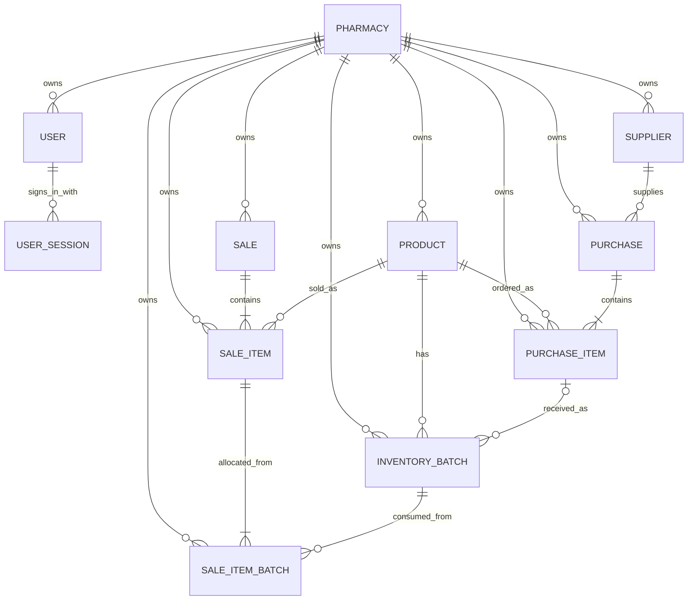

# Database foundations

This note explains the database structure behind the current API. The source of truth is the SQLAlchemy model definitions in `backend/models.py`.

## Relationship map

## Keys and relationships

- A **primary key** uniquely identifies a row. Each table has an integer `id` primary key.
- A **foreign key** points to a related row. For example, `inventory_batches.product_id` references `products.id`.
- An ORM **relationship** lets Python code navigate those links, such as `product.batches` or `purchase.items`; it does not replace the database foreign key.
- SQLite foreign-key enforcement is enabled when connections open. The database also checks important invariants such as nonnegative stock and positive sale quantities.

## Normalization and history

- Product details are stored once; every batch points to its product. Stock is summed from batches instead of duplicated in a product-level counter.
- A purchase line records ordered quantity and unit cost. Each receipt creates its own dated inventory batch.
- A sale line records the selling price used at checkout. Its batch allocations record the exact batch, quantity, and cost used. Later price or cost changes therefore do not rewrite sale history.
- Products and suppliers are archived rather than hard-deleted so past transactions keep their references.

## Indexes

Product and supplier names are indexed for lookups. Barcodes are unique within each pharmacy account. Inventory has an index on product and expiry date for stock summaries and FEFO selection. Sale and purchase timestamps are indexed for reporting.

## Multi-pharmacy tenancy

Each `pharmacies` row is an account boundary. A user belongs to one pharmacy, and a session stores only a hash of its random browser token. Every business table has a `tenant_id`; authenticated requests set the active tenant on their database session, and ORM reads, bulk updates, and inserts are scoped to that tenant. Anonymous requests cannot use pharmacy operation routes.

New local databases use SQLite; the public deployment configuration uses PostgreSQL. Startup can replace the previous local schema only if its business tables are empty. If legacy records exist, startup stops without altering them so they can be explicitly migrated. Role-based staff accounts, audit history, email verification, and password recovery remain future work.
